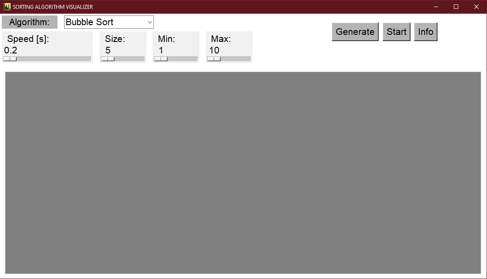
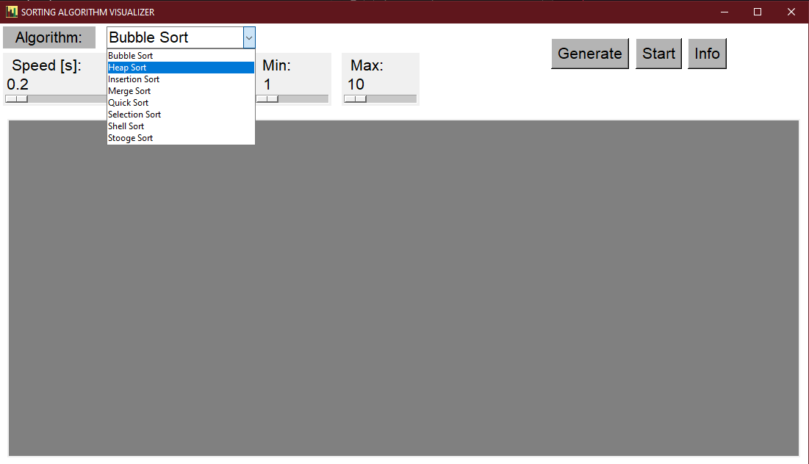
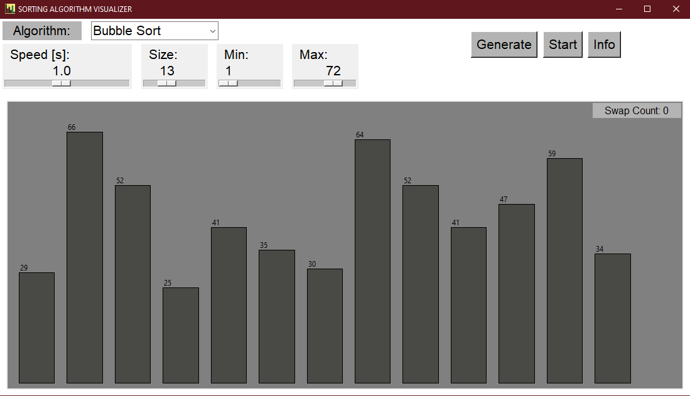
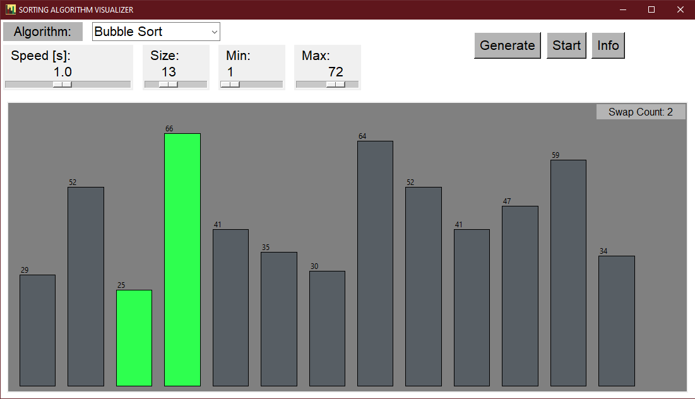
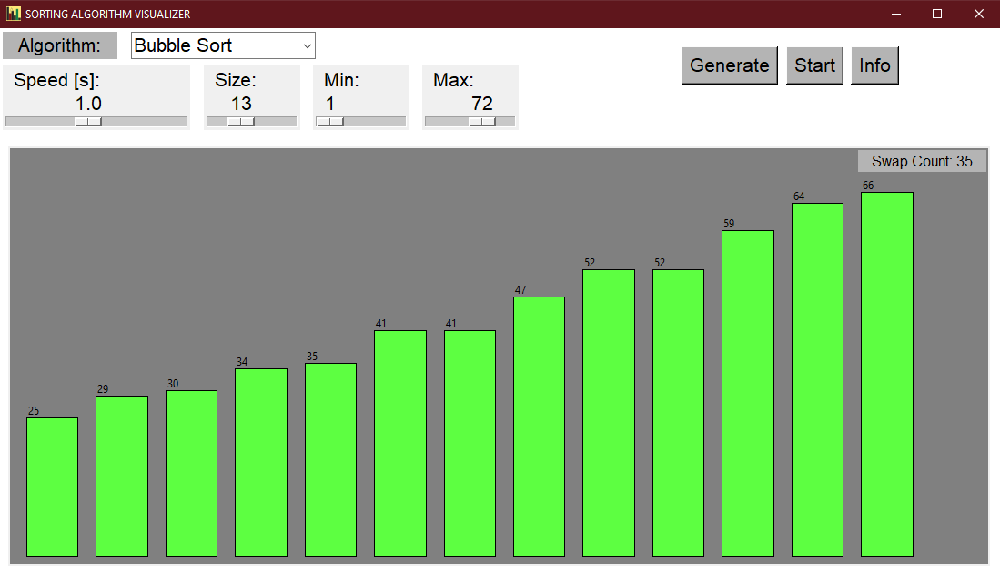
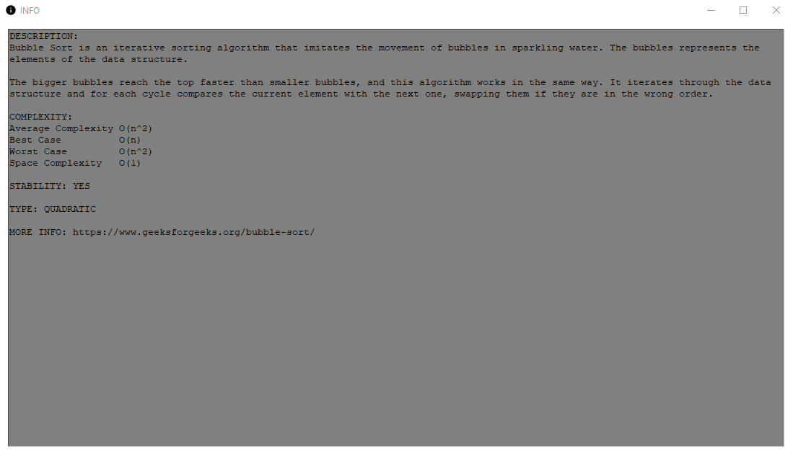

# SORTING ALGORITHM VISUALIZER

The project has been implemented in Python using Tkinter. The program allows the user to select from a range of sorting algorithms, choose the number of elements to be sorted, and input the speed at which the visualization process will run. It also displays the number of steps taken until the array is sorted. Additionally, there is an INFO section that provides information about each sorting algorithm.

The project is inspierd by https://www.youtube.com/@TechieCoder

## IMPLEMENTED ALGORITHMS

- [Bubble Sort](https://www.geeksforgeeks.org/bubble-sort/)
- [Heap Sort](https://www.geeksforgeeks.org/heap-sort/)
- [Insertion Sort](https://www.geeksforgeeks.org/insertion-sort/)
- [Merge Sort](https://www.geeksforgeeks.org/merge-sort/)
- [Quick Sort](https://www.geeksforgeeks.org/quick-sort/)
- [Selection Sort](https://www.geeksforgeeks.org/selection-sort/)
- [ShellSort](https://www.geeksforgeeks.org/shellsort/)
- [Stooge Sort](https://www.geeksforgeeks.org/stooge-sort/)

## FUNCTIONALITIES
- Array size can be changed
- Visualization speed can be adjusted 
- Minimum and maximum value can be changed
- The number of steps until the array is sorted is displayed 
- INFO button for details about each implemented algorithm

## PREVIEW
  
  
  

